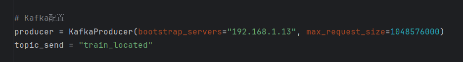
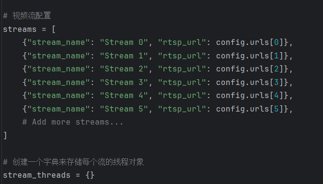
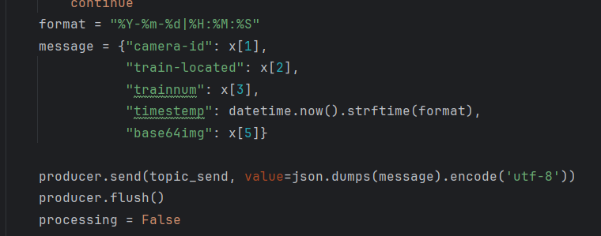
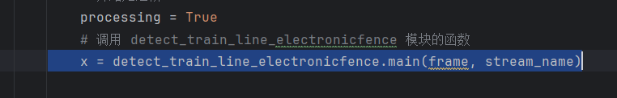
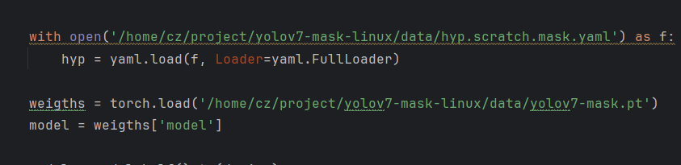
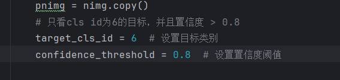
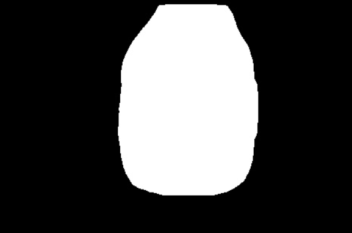
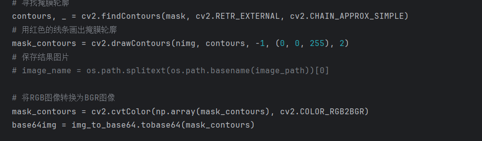
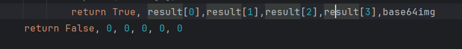
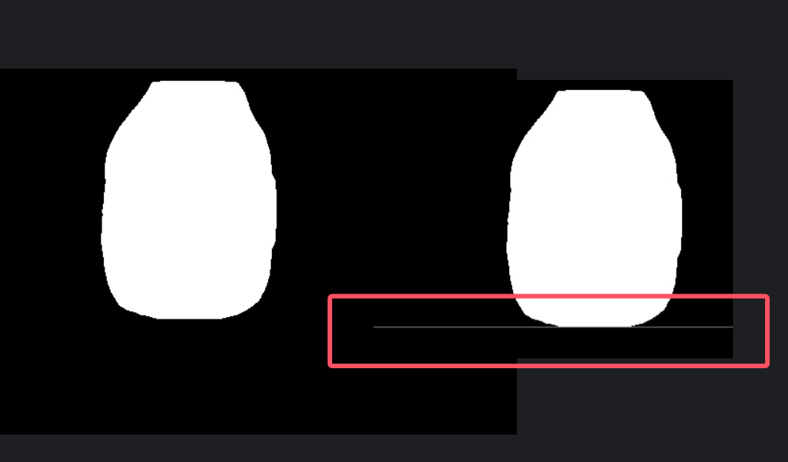

# 滁宁列车轮廓（outline）提取

开始之前，说明一下这个代码是大一大二那会儿写的，可能有点屎，但是能用+注释多（后期chatgpt加的）

程序基于yolov7-mask的branch，实例分割+掩膜提取

## 1.文件目录

### 1.1zinput and zoutput

zinput和zoutput分别为测试时的输入和输出的路径

包含img和mp4，其中no1-no4是画面中没有”列车“这个类的测试用图

### 1.2run_rtsp_located.py

此为程序入口，包含

kafka配置

从config中取流配置

send 给kafka 的message格式配置

其余为线程重启与kill逻辑，这个文件的写法与chuning_ocr的逻辑基本一致

最重要的为调用detect_train_line_electronicfence.py进行单帧处理

### 1.3detect_train_line_electronicfence.py

此脚本根据github  yolov7-mask的script改写，地址如下

[WongKinYiu/yolov7](https://github.com/WongKinYiu/yolov7/blob/mask/tools/instance.ipynb)

在文件开头能看到一堆的import，那是为了减少文件数量，从而将后续需要用到的某些包的代码直接copy了过来，（危险操作，当时不太懂）

从main方法看就好了

首先加载权重

分割完之后，只留下class=6的掩膜部分（6在coco数据集里面是train）

此时关注这个pnimg，这个是掩膜对象，可以直接imwrite保存下来，如下图

随后将mask传入electronicfence.py进行二值化处理

后面为画出轮廓线的核心，线的颜色可以换。进行了一步rgb转换，解决颜色通道错误的问题

最后面return到run_rtsp_located.py里面，下面的是没有车，上面的是有车

return的 这个result可以在electronicfence.py里面查看

### 1.4electronicfence.py

自下而上找到第一个白色像素所在的行，并画一根线，用于确定是否超过设定位置

下图里面框出来的线

### 1.5config.py

三个作用

1 设置是否保存图片 （开启imwrite方法）

2 urls里面设置retsp地址，可以用本地文件

3 设置电子围栏像素值

## 2.pip包下载

重点是detectron2！！！！这个包比较难下，百度各种找教程吧，当时下了一天。需要编译，需要cmake环境

其余的包都还行，且都在requirement里面，但是不要直接 pip -r xx.txt

因为这个env是跟ocr公用的，很多包可能用不上，建议直接跑run_rtsp_located.py，然后缺啥补啥

